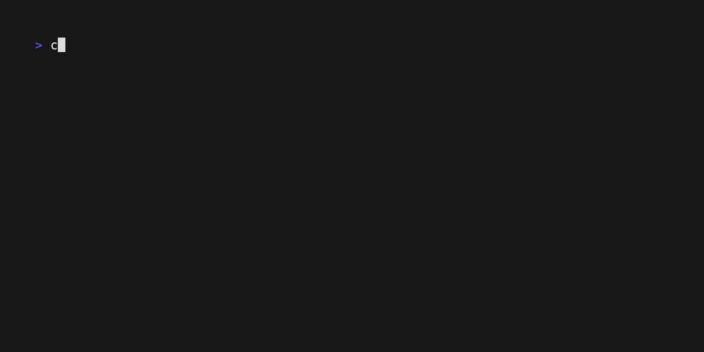

# SQLite Shell



**SQLite Shell** is a Terminal User Interface (TUI) application written in Go that provides an interactive shell for executing SQLite commands. It leverages libraries like [Bubble Tea](https://github.com/charmbracelet/bubbletea) to create a rich and user-friendly TUI experience.

## Features

- Execute SQL queries on a specified SQLite database.
- View query results in a tabular format within the terminal.
- Intuitive navigation and input handling.

## Installation

1. Clone the repository:

   ```sh
   git clone https://github.com/iamhectorsosa/sqlite-shell.git
   cd sqlite-shell
   ```

2. Build the project:

   ```sh
   go build -o sqlite-shell
   ```

## Usage

Run the program with the path to an SQLite database file:

```sh
./sqlite-shell <databasePath>
```

## Work in Progress

This project is still under development. Expect frequent updates and new features. Contributions and feedback are welcome!

---

Made with Go and ❤️.
